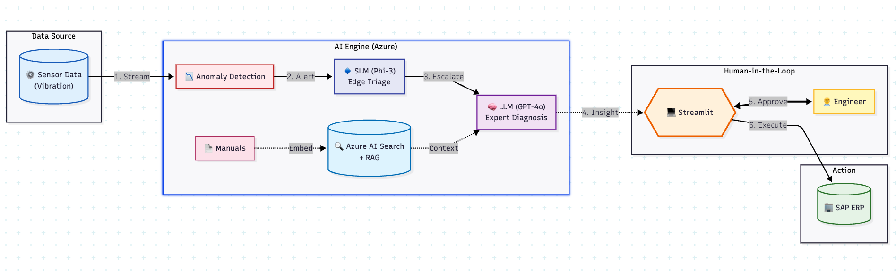

# 🛡️ Enerflex Asset Guardian: Cognitive Maintenance Pilot (Oman)

### Optimizing BOOM Models via OT/IT Convergence

> **🔗 Live Demo:** [Launch App](https://enerflex-demo-asset-guardian.streamlit.app/)
> **📑 Project Slides:** [View Presentation](https://gamma.app/docs/Enerflex-Grace-Kuo-j1o53bdnwjhk3vo)

---

## 📑 Table of Contents

- [Executive Summary](#-executive-summary)
- [System Architecture](#️-system-architecture)
- [Key Technical Features](#-key-technical-features)
- [Tech Stack](#️-tech-stack)
- [How to Run Locally](#-how-to-run-locally)
- [Note to Interviewers](#-note-to-interviewers)

---

## 📖 Executive Summary

*For the Interviewer: The "Why" behind this project.*

In remote oil & gas fields (specifically our pilot in Oman), "downtime" is the most expensive currency. This project addresses three critical gaps in the traditional maintenance workflow:

1. **Reactive Risk:** SCADA alarms typically trigger only *after* damage has occurred.
2. **Knowledge Gap:** Junior on-site technicians lack immediate access to senior experts for complex diagnosis.
3. **OT/IT Disconnect:** Diagnostic data (OT) is isolated from Inventory data (IT/SAP), causing delays in parts procurement.

**Enerflex Asset Guardian** is an end-to-end **Cognitive Maintenance System** that bridges these gaps using a **Hybrid AI architecture** (Edge SLM + Cloud LLM).

---

## 🏗️ System Architecture

The system follows a tiered intelligence architecture designed to optimize cloud costs and latency.



*Figure: End-to-end data flow from OT sensors to IT/SAP integration*

### 🧠 Workflow Explanation

The architecture is designed to mimic a "Digital Engineer" workflow:

1. **Data Ingestion (OT Layer):**
   * Real-time vibration sensor data (simulated Ariel JGT/4 Compressor) is streamed into the system.

2. **Tier 1: Edge Triage (SLM - Phi-3):**
   * **Engineering Decision:** Instead of sending *every* data point to a costly GPT-4 model, we use a Small Language Model (SLM), **Phi-3**, as a gatekeeper.
   * It acts as an anomaly detector, filtering out noise and only escalating "high-drift" events to the cloud. This reduces inference costs by ~90%.

3. **Tier 2: Expert Diagnosis (LLM - GPT-4o + RAG):**
   * When an anomaly is escalated, **GPT-4o** analyzes the trend.
   * **RAG Implementation:** To prevent hallucinations, the model retrieves context from **Azure AI Search** (indexed technical manuals) before generating a diagnosis. This ensures the advice is grounded in manufacturer specifications.

4. **Human-in-the-Loop:**
   * The AI provides an "Insight," but does not auto-execute. A human engineer reviews the diagnosis via the Streamlit dashboard.

5. **Action (IT Layer - SAP Integration):**
   * Upon approval, the system connects to **SAP S/4HANA** (simulated) to check parts availability (MM Module) and automatically generate a Work Order (PM Module).


---

## 🚀 Key Technical Features

### 1. Hybrid AI Strategy (SLM vs. LLM)

A key challenge in industrial AI is the cost of inference. This project implements a **tiered architecture**:

* **Edge:** `Phi-3 Mini` (Low latency, privacy-preserving, runs locally) for continuous monitoring.
* **Cloud:** `GPT-4o` (High reasoning, high cost) triggered *only* during confirmed anomalies.

### 2. Retrieval-Augmented Generation (RAG)

Industrial diagnosis requires high precision.

* **Tech Stack:** Azure AI Search + Azure OpenAI Embeddings.
* **Workflow:** User Query → Vector Embedding → Semantic Search in Manuals → GPT-4o Synthesis.
* **Result:** The model cites specific manual sections rather than guessing.

### 3. Full-Stack Integration (Streamlit)

The user interface is built with **Streamlit** to provide a rapid, interactive dashboard for field engineers. It visualizes:

* Real-time sensor plotting (Plotly).
* API JSON responses from SAP.
* AI reasoning traces (Chain-of-Thought).

---

## 🛠️ Tech Stack

| Component | Technology Used |
| --- | --- |
| **Frontend** | Python, Streamlit, Plotly |
| **Edge AI** | Phi-3 Mini (Simulated logic for demo) |
| **Cloud AI** | Azure OpenAI Service (GPT-4o), Azure AI Search |
| **Backend Logic** | Python (Pandas for data processing) |
| **ERP Simulation** | JSON-based Mock API (SAP S/4HANA structure) |
| **Deployment** | Streamlit Cloud |

---

## 💻 How to Run Locally

1. **Clone the repository**
```bash
git clone https://github.com/yourusername/enerflex-asset-guardian.git

```


2. **Install dependencies**
```bash
pip install -r requirements.txt

```


3. **Configure Secrets**
Create a `.streamlit/secrets.toml` file with your Azure credentials:
```toml
AZURE_OPENAI_ENDPOINT = "your-endpoint"
AZURE_OPENAI_API_KEY = "your-key"
AZURE_OPENAI_DEPLOYMENT_NAME = "gpt-4o"
SEARCH_ENDPOINT = "your-search-endpoint"

```


4. **Run the App**
```bash
streamlit run app.py

```


---

## 👨‍💻 Note to Interviewers

This project was built to demonstrate **Product Thinking** in AI engineering. It moves beyond "chatting with a PDF" to solving a specific business problem: **reducing Mean Time To Repair (MTTR)**.

By integrating **Anomaly Detection**, **Generative AI**, and **ERP Actions**, it represents a shift from "Predictive Maintenance" (telling you it will break) to "Prescriptive Maintenance" (telling you how to fix it and ordering the parts).